  <!-- HEADER -->

  <!-- Cor Sólida
  

    
  

  -->

  <!-- Gradient -->
  

    
  

  <!-- TÍTULO -->

  <!-- Ciano -->
  

    
  

  <!-- Vinho 
  

    
  

  -->
  
   

  <!-- DESCRIÇÃO -->
  

    I am a <b>Software Developer</b> with a strong focus on <b>iOS and Fullstack development</b>, currently studying Software Engineering at the <b>Catholic University of Brasília</b>.  
    I work as an <b>iOS Developer at the Apple Developer Academy</b>, where I participate in the entire app development lifecycle, integrating embedded Artificial Intelligence and focusing on user experience. This dedication to the Apple ecosystem also led to my selection for the WWDC 2026 special event in Cupertino.  
    I love solving complex problems and exploring different areas of technology, always prioritizing technical quality, clean code practices, and delivering real-world impact. 🚀  
  

  ---

  <!-- SOCIALS -->
  

    
<b>🌐 Socials:</b>

     
    

      
      
      
      
    

  

  <!-- TECH STACK -->
  

    
<b>💻 Tech Stack:</b>

     
    <b>🍎 Apple Ecosystem & Mobile</b> 
    

      
      
      
    

     
    <b>🌐 Frontend & UI/UX</b> 
    

      
      
      
      
      
      
      
      
    

     
    <b>⚙️ Backend, APIs & Automation</b> 
    

      
      
      
      
      
      
      
    

     
    <b>🗄️ Data & Infrastructure</b> 
    

      
      
      
      
      
      
    

     
    <b>🛠️ Tools & Version Control</b> 
    

      
      
      
      
    

  

  <!-- GITHUB STATS -->
  

    
<b>📊 GitHub Stats</b>

    

      
      
      
    

  

  <!-- RANDOM QUOTE -->
  

    
<b>✍️ Random Dev Quote</b>

     
    

      
    

  

  <!-- PACMAN CONTRIBUTION -->
  

    
<b>🗓️ Contribution Graph</b>

     
    <picture>
        <source media="(prefers-color-scheme: dark)" srcset="./profile/pacman-dark.svg">
        <source media="(prefers-color-scheme: light)" srcset="./profile/pacman.svg">
        
    </picture>
  

  <!-- CONTRIBUTIONS -->
  <!-- 

    
<b>🔝 Top Contributed Repo</b>

     
    

      
    

  

  -->

  <!-- FOOTER -->

  <!-- Cor Sólida
  

    
  

  -->

  <!-- Gradient -->
  

    
  

